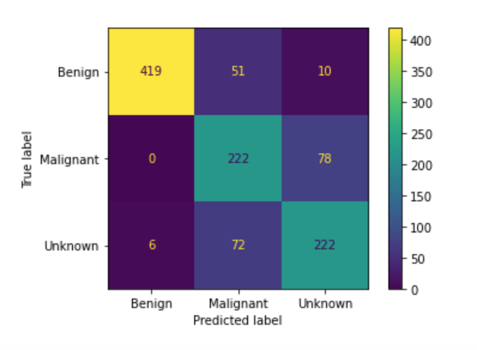
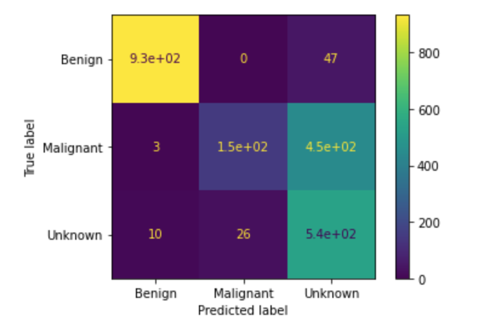

# Identifying Skin Lesions In Dermoscopic Images With Neural Networks

### Author: Eric Denbin

<p align="center">
  
</p>

## Business Understanding

Skin cancer is the most common form of cancer in the United States and worldwide. In the United States, more people are diagnosed with skin cancer each year than all other cancers combined.

Clinical diagnosis of skin lesions is done using single image expert consensus or serial imaging. If a lesion is suspected to be malignant, the specific type of lesion is determined through histopathological analysis of a biopsy. 

According to a study published in April of 2021 in the Dermatology Research and Practice journal, 99.06% of the lesions clinically diagnosed as benign were actually benign, while 30.38% of the lesions clinically diagnosed as malignant were actually malignant(https://www.hindawi.com/journals/drp/2021/6618990). This means that less than 1% of the lesions diagnosed as benign in the study were actually malignant, and close to 70% of the lesions diagnosed as malignant in the study were actually benign. So while medical professionals are very precise when it comes to correctly diagnosing benign lesions, they are quite imprecise when it comes to correctly diagnosing malignant lesions. This makes sense given that medical professionals do not want to misdiagnose a malignant lesion as benign, but ultimately this imprecision makes clinical diagnosis somewhat inefficient. A study published in the Journal of Clinical Oncology in June of 2018, estimated that biopsies of benign tumors cost between $624 million and $1.7 billion(https://ascopubs.org/doi/abs/10.1200/JCO.2018.36.15_suppl.e18903).


## Data Understanding

My dataset consists of 7,179 dermoscopic images from the Internation Skin Imaging Collaboration(ISIC) archive (https://www.isic-archive.com/). All patients were 10-90 years old and the images were taken in the course of clinical care.

The following file structure provides the ground truth labeling needed to train the models. If you wish to run my code, you will need to download images from the ISIC archive into the same directory format:
```
└── dermoscopic_images
    ├── train
    │    ├──benign
    |    ├──malignant
    │    └──unknown
    └── test
         ├──benign
         ├──malignant
         └──unknown
```

The ISIC archive contains over 150,000 images, 70,000 of which have been made public. I downloaded only dermoscopic images to ensure a certain standard of quality in regard to the data. The archive contains 23,704 dermoscopic images of benign lesions, 2,240 dermoscopic images of malignant lesions, and 2,212 dermoscopic images of unknown lesions. I downloaded 2,401 images of benign lesions for training and validation, and 600 images of benign lesions for testing. I downloaded 1500 images of malignant lesions for training and validation, and 600 for testing. For unkown lesions, I downloaded 1500 images for training and validation, and 600 for testing. The class balance in my training set is 44% images of benign lesions, 28% images of malignant lesions, and 28% images of unknown lesions.

<p align="center">
  
</p>


## Modeling with neural networks

My first simple model consists of a basic fully connected dense neural network with two hidden layers, plus an output layer. 
This model serves as a proof of concept and provides baseline metrics.

The following is the confusion matrix it produced:

<p align="center">
  
</p>

To improve on my first simple model, I began iterating on convolutional neural networks. The following are various adjustments made over these iterations to improve model performance:
 - Adding more dense layers
 - Adding convolutional layers
 - Adding dropout layers
 - Adding batch normalization layers
 - Using L2 regularization
 - Trying different kernel sizes

The following is the confusion matrix of my best performing CNN model:

<p align="center">
  
</p>

*How iterations improved model*

Once the performance of the convolutional neural networks I trained using custom architecture plateaued, I began exploring transfer learning. For the first iteration, I used the pre-trained VGG16 model with the 'imagenet' weights as a base, and the same architecture from my best convolutional neural network to construct the fully connected dense layers. The following are other adjustments I made as I continued iterating:
 - Increasing the number of dense layers 
 - Increasing the number of nodes in the first hidden layer with each additional layer

 
Collectively, I iterated through ten models, adjusting these features parameters among others. My final model has the following architecture:


## Final Evaluation

The final model...

<p align="center">
  
</p>

On unseen testing data...


## Conclusions

### Recommendations

- I recommend that this model be used as part of the clinical diagnosis of skin lesions.

- If a skin lesion is clinically diagnosed as benign, I recommend that this model is not used, as medical professionals are more precise             diagnosing       benign lesions than the model.

- If a lesion is clinically diagnosed as malignant and the model predicts it to be benign, I recommend that that the clinical diagnosis be rejected the clinical as   the model is just 1% less precise than medical professionals when it comes to predicting benign lesions, and while 70% of lesions medical professionals diagnose   as malignant are benign, the model does not misdiagnose any malignant lesions as being benign.

- I recommend that if a lesion is clinically diagnosed as malignant and the model predicts it to be malignant or unknown, confirm the clinical diagnosis.

- Finally, I recommend that this model be used to reduce the number of biopsies taken of benign lesions that were clinically diagnosed as malignant.


### Next Steps

- Get more dermoscopic images of those skin conditions in the archive that are underrepresented 

- Train a binary classifier that predicts only benign and malignant lesions

- Train a multiclass classifier that predicts specific types of lesions, such as melanoma, basal cell carcinoma, squamous cell caricnoma, etc.


## For More Information

See the full analysis in the [Jupyter Notebook](./.ipynb) or review this [presentation](./.pdf)


### Structure of Repository:

```
├── images (for readme, presentation)
├── code
├── net2vis_images
├── Capstone_presentation_draft.pdf
├── README.md
├── data
├── models (saved .h5 files of trained models)
├── callback_checkpoints
├── LICENSE.md
└── CONTRIBUTING.md
```
