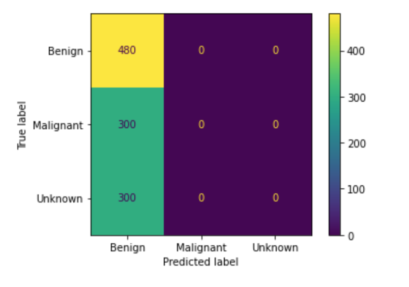
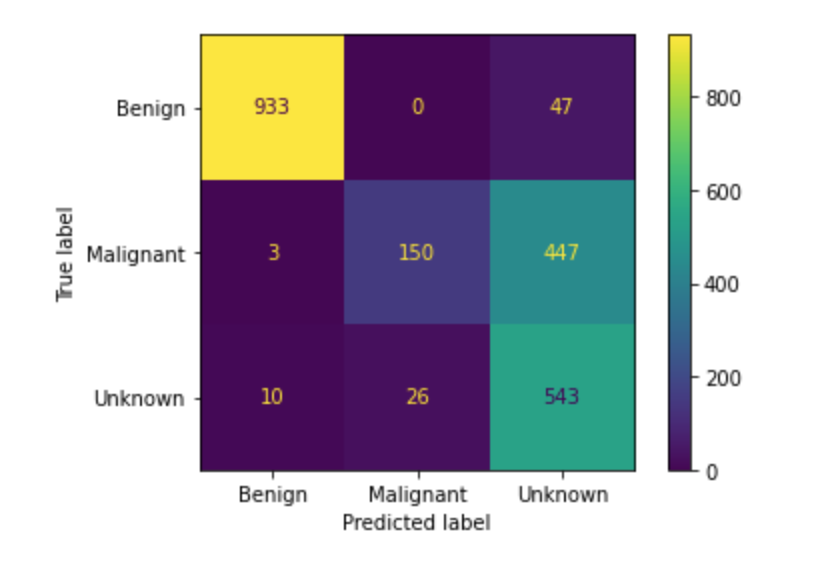

# Classifying Skin Lesions In Dermoscopic Images With Neural Networks

### Author: Eric Denbin

<p align="center">
  
</p>

## Business Understanding

Skin cancer is the most common form of cancer in the United States and worldwide. In the United States, more people are diagnosed with skin cancer each year than all other forms of cancer combined.

<p align="center">
  
</p>

Skin lesions are typically first diagnosed using clinical methods, such as single image expert consensus or serial imaging of dermoscopic images. At this stage of the diagnostic process, medical professionals are visually examining the size, color, shape, uniformity, and location of skin lesions. 

<p align="center">
  
</p>

If a diagnosis is uncertain, more clinical tests may be performed. These include blood tests, allergy tests, and skin swabs, among others. At this point, if a lesion is suspicious for malignancy, or the diagnosis is still uncertain, the specific type of lesion is determined by analyzing a biopsy under a microscope.

<p align="center">
  
</p>

When it comes to clinically diagnosing skin lesions, medical professionals often misdiagnose benign lesions as being suspicious for malignancy. According to a study published in April of 2021 in the Dermatology Research And Practice journal, while 99.06% of the lesions clinically diagnosed as benign were actually benign, just 82.85% of all benign lesions were identified (https://www.hindawi.com/journals/drp/2021/6618990). This results in an inefficient use of resources. A study published in the Journal Of Clinical Oncology in June of 2018, estimated that biopsies of benign lesions cost between $624 million and $1.7 billion over the course of a year (https://ascopubs.org/doi/abs/10.1200/JCO.2018.36.15_suppl.e18903).

Given those facts, a model could be used to identify misdiagnosed benign lesions, and therefore reduce the number of biopsies taken of benign lesions.


## Data Understanding

My dataset consists of 7,179 dermoscopic images from the International Skin Imaging Collaboration(ISIC) archive (https://www.isic-archive.com/). All patients were 10-90 years old and the images were taken in the course of clinical care.

<p align="center">
  
</p>

The ISIC archive contains over 150,000 images, 70,000 of which have been made public. I downloaded only dermoscopic images to ensure a certain standard of quality in regard to the data. The archive contains 23,704 dermoscopic images of benign lesions, 2,240 dermoscopic images of malignant lesions, and 2,212 dermoscopic images of unknown lesions. I downloaded 2,401 images of benign lesions for training and validation, and 980 images of benign lesions for testing. I downloaded 1500 dermoscopic images of malignant lesions for training and validation, and 600 for testing. I downloaded 1500 dermoscopic images of unknown lesions for training and validation, and 600 for testing. The class balance in my training set is 44.44% images of benign lesions, 27.78% images of malignant lesions, and 27.78% images of unknown lesions.

<p align="center">
  
</p>

The following file structure provides the ground truth labeling needed to train the models. If you wish to run my code, you will need to download images from the ISIC archive into the same directory format:
```
└── dermoscopic_images
    ├── train
    │    ├──benign
    |    ├──malignant
    │    └──unknown
    └── test
         ├──benign
         ├──malignant
         └──unknown
```


## Modeling With Neural Networks

The first simple model consists of a basic fully connected dense neural network with two hidden layers, plus an output layer. 
This model serves as a proof of concept and provides baseline metrics.

The following is the confusion matrix it produced:

<p align="center">
  
</p>

The first simple model returned a validation accuracy of 44.44%, as it predicted every image to be part of the benign class. Given that I trained it for just five epochs as a proof of concept, these results were as much as I expected.


To improve on the first simple model, I began iterating on convolutional neural networks. The following are various adjustments made over these iterations to improve model performance:
 - Adding more dense layers
 - Adding convolutional layers
 - Adding dropout layers
 - Adding batch normalization layers
 - Using L2 regularization
 - Trying different kernel sizes

Using convolutional neural networks, the validation accuracy of the models increased along with precision and recall in predicting the benign class. However, the validation accuracy reached a ceiling around 68% and the model's precision and recall in predicting the malignant class was volatile.

In an effort to improve model performance, and particularly precision and recall when predicting the benign class, I began exploring transfer learning. I used the pre-trained VGG16 model with the 'imagenet' weights as a base, and the same architecture from my best convolutional neural network to construct the fully connected dense layers. The following are other adjustments I made as I continued iterating:
 - Increasing the number of dense layers 
 - Increasing the number of nodes in the first hidden layer with each additional layer

 
Collectively, I iterated through more than ten models, going from a fully connected dense neural network, to convolutional neural networks with custom architecture, and finally, to convolutional neural networks with the pre-trained VGG16 model as a base, with custom architecture for the fully connected dense layers. My final model has the following architecture:

<p align="center">
  
</p>

Below is a diagram of the best model that depicts the portion of the VGG16 model I used as a base, as well as the fully connected dense layers:

<p align="center">
  
</p>

<p align="center">
  
</p>


## Final Model Evaluation

I trained the best model for 25 epochs with a batch size of 128 images. The following shows the confusion matrix results after evaluating the best model on the testing dataset:

<p align="center">
  
</p>

The accuracy of the best model on the test set was just 75.31%, but in terms of my key metric, F1 score, it performed quite well.

Out of 946 lesions the model predicted to be benign, it correctly diagnosed 933, and misdiagnosed just 3 malignant lesions and 10 unknown lesions. This means that its precision when predicting lesions to be benign is 98.63%, which is less than a half of a percent lower than the precision of medical professionals clinically diagnosing lesions to be benign. 

Out of 980 total benign lesions, the model was able to identify 933. This means that its recall when predicting lesions to be benign is 95.20%, which is about 13% better than the recall of medical professionals clinically diagnosing lesions to be benign. Using these values, the F1 score comes out to 96.88. 

It is important to note that the model does have trouble distinguishing between malignant and unknown lesions, as demonstrated by the 447 malignant lesions the model predicted to be unknown. However, as it relates to my business problem, this is irrelevant, because a biopsy would be taken regardless of whether a lesion is diagnosed as malignant or unknown. What is important is that there are no benign lesions misdiagnosed as malignant, and only 4.80% of all benign lesions are misdiagnosed as unknown.

Given the best model’s precision and recall as it relates to predicting benign lesions, it could successfully be used to identify misdiagnosed benign lesions, and therefore reduce the number of biopsies taken of benign lesions.


## Exploring The Blackbox

In an effort to understand what features of each image the best model was using to make its predictions, I used the lime library to visualize the pros and cons mask, as well as the predictive boundary, for several correctly classified and misclassified images. 

Examples of a correctly classified image from each class with the pros and cons mask laid over the top:

<p align="center">
  
</p>

Examples of a misclassified image from each class with the pros and cons mask laid over the top:

<p align="center">
  
</p>

**Analysis:** It appears from this brief exploration that the best model is focusing on the lesion when it correctly classifies an image, and is focusing on the skin surrounding the lesion when it misclassifies an image. However, these are three particularly good examples of both correctly classified and misclassified images, and are not representative of how the model made all of its correct and incorrect predictions. There were some correctly classified images where the model used the surrounding skin to make its prediction, and some misclassified images where the model was focusing on the lesion. I would need to investigate further to determine exactly how and why the model predicts each image the way it does.


## Conclusions

### Recommendations

- I recommend that this model be used as part of the clinical diagnosis of skin lesions.

- If a skin lesion is clinically diagnosed as benign, I recommend that this model is not used, as medical professional's precision when it comes to diagnosing       benign lesions is over 99%.

- If a lesion is clinically diagnosed as malignant, and the model predicts it to be benign, I recommend that the clinical diagnosis be rejected, as the model is     not even half of a percent less precise than medical professionals in clinically diagnosing a lesion to be benign. 
 
- If a lesion is clinically diagnosed as malignant, and the model predicts it to be malignant or unknown, I recommend that the clinical diagnosis be confirmed, as   the model only misdiagnoses benign lesions as either malignant or unknown 4.80% of the time.

- Finally, I recommend that this model be used to reduce the number of biopsies taken of benign lesions that were clinically diagnosed as malignant.


### Next Steps

- Get more dermoscopic images of those skin specific types of skin lesions that are underrepresented in the archive.

- Train a multiclass classifier that predicts specific types of lesions, such as melanoma, basal cell carcinoma, squamous cell caricnoma, etc.


## For More Information

See the full analysis in the [Jupyter Notebook](./skin_lesion_image_classifier.ipynb) or review this [presentation](./skin_lesion_image_classifier_presentation.pdf)


### Structure of Repository:

```
├── .ipynb_checkpoints
├── code
├── images
├── models (saved .h5 files of trained models)
├── .gitignore
├── CONTRIBUTING.md
├── LICENSE.md
├── README.md
├── skin_lesion_image_classifier.ipynb
└── skin_lesion_image_classifier.pdf
```
