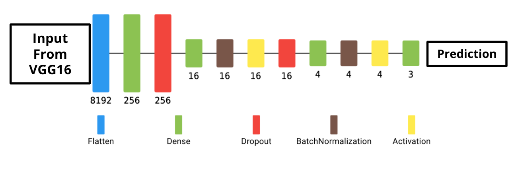

# Classifying Skin Lesions In Dermoscopic Images With Neural Networks

### Author: Eric Denbin

<p align="center">
  
</p>

## Business Understanding

Skin cancer is the most common form of cancer in the United States and worldwide. In the United States, more people are diagnosed with skin cancer each year than all other cancers combined.

<p align="center">
  
</p>

Skin lesions are typically first diagnosed using clinical methods, either through single image expert consensus or serial imaging of dermoscopic images. At this stage of the diagnostic process, medical professionals are visually examining the size, color, shape, uniformity, and location of skin lesions. 

<p align="center">
  
</p>

If a diagnosis is uncertain, more clinical tests may be performed. These include blood tests, allergy tests, and skin swabs. At this point, if a lesion is suspected to be malignant, or the diagnosis is still uncertain, the specific type of lesion is determined by analyzing a biopsy under a microscope.

<p align="center">
  
</p>

Now, according to a study published in April of 2021 in the Dermatology Research and Practice journal, 99.06% of the lesions that were clinically diagnosed as benign were actually benign, while 82.85% of benign lesions were identified. So while medical professionals are very precise when it comes to correctly diagnosing benign lesions using clinical methods, they often misdiagnose a significant portion of benign lesions as being suspicious of malignancy. This makes sense given that medical professionals do not want to misdiagnose a malignant lesion as benign, but ultimately this imprecision makes clinical diagnosis somewhat inefficient. A study published in the Journal of Clinical Oncology in June of 2018, estimated that biopsies of benign lesions cost between \$624 million and $1.7 billion over the course of the year.

Given the performance of medical professionals when it comes to clinically diagnosing skin lesions, a model will be most beneficial in confirming or rejecting a clinical diagnosis of a lesion being suspicious for malignancy. In practice, this means that if a medical professional diagnoses a lesion as being suspicious for malignancy, a model could be used to either confirm the lesion is suspicious for malignancy, or identify said lesion as being benign, and therefore misdiagnosed, meaning a biopsy does not need to be taken.


## Data Understanding

My dataset consists of 7,179 dermoscopic images from the Internation Skin Imaging Collaboration(ISIC) archive (https://www.isic-archive.com/). All patients were 10-90 years old and the images were taken in the course of clinical care.

<p align="center">
  
</p>

The ISIC archive contains over 150,000 images, 70,000 of which have been made public. I downloaded only dermoscopic images to ensure a certain standard of quality in regard to the data. The archive contains 23,704 dermoscopic images of benign lesions, 2,240 dermoscopic images of malignant lesions, and 2,212 dermoscopic images of unknown lesions. I downloaded 2,401 images of benign lesions for training and validation, and 980 images of benign lesions for testing. I downloaded 1500 dermoscopic images of malignant lesions for training and validation, and 600 for testing. I downloaded 1500 dermoscopic images of unknown for training and validation, and 600 for testing. The class balance in my training set is 44% images of benign lesions, 28% images of malignant lesions, and 28% images of unknown lesions.

<p align="center">
  
</p>

The following file structure provides the ground truth labeling needed to train the models. If you wish to run my code, you will need to download images from the ISIC archive into the same directory format:
```
└── dermoscopic_images
    ├── train
    │    ├──benign
    |    ├──malignant
    │    └──unknown
    └── test
         ├──benign
         ├──malignant
         └──unknown
```


## Modeling With Neural Networks

My first simple model consists of a basic fully connected dense neural network with two hidden layers, plus an output layer. 
This model serves as a proof of concept and provides baseline metrics.

The following is the confusion matrix it produced:

<p align="center">
  
</p>

The first simple model returned a validation accuracy of 44.44%, as it predicted every image to be part of the benign class. Given that I trained it for just five epochs as a proof of concept, these results were as much as I expected.


To improve on my first simple model, I began iterating on convolutional neural networks. The following are various adjustments made over these iterations to improve model performance:
 - Adding more dense layers
 - Adding convolutional layers
 - Adding dropout layers
 - Adding batch normalization layers
 - Using L2 regularization
 - Trying different kernel sizes

Using convolutional neural networks, the validation accuracy of the models increased along with precision in predicting the benign class. However, the validation accuracy reached a ceiling around 68% and the model's precision in predicting the malignant class remained below 50%.

In an effort to improve model performance, and particularly precision when predicting the benign and malignant classes, I began exploring transfer learning. I used the pre-trained VGG16 model with the 'imagenet' weights as a base, and the same architecture from my best convolutional neural network to construct the fully connected dense layers. The following are other adjustments I made as I continued iterating:
 - Increasing the number of dense layers 
 - Increasing the number of nodes in the first hidden layer with each additional layer

 
Collectively, I iterated through more than ten models, going from a fully connected dense neural network, to convolutional neural networks with custom architecture, and finally to convolutional neural networks with the pre-trained VGG16 model as a base. My final model has the following architecture:

<p align="center">
  
</p>

Below is a diagram of my final model, showing the architecture of the VGG16 model, as well as the fully connected dense layers:

<p align="center">
  
</p>

<p align="center">
  
</p>


## Final Model Evaluation

I trained my final model for 25 epochs with a batch size of 128 images. The model's overall accuracy on the holdout set was just 75.31%, but in terms of my key metric, precision, specifically as it relates to predicting the benign and malignant classes, it performed quite well. The following shows the confusion matrix results after evaluating the final model on the the holdout dataset:

<p align="center">
  
</p>

Out of 946 lesions the model predicted were benign, it misdiagnosed just 3 malignant lesions and 10 unknown lesions, meaning its precision when predicting a lesion to be benign is 98.63%, which is less than 1% lower than a medical professional’s precision when clinically diagnosing a lesion to be benign. Out of 176 lesions the model predicted to be malignant, it misdiagnosed just 26 unknown lesions and 0 benign lesions. This means that the model’s precision when predicting a lesion to be malignant is 85.23%, which is 55% higher than a medical professional’s precision when clinically diagnosing a lesion to be malignant. 

Given the model’s precision when predicting both benign and malignant lesions, the model could successfully be used to identify benign lesions that a medical professional has misdiagnosed as malignant, and therefore reduce the number of biopsies taken of benign lesions.


## Conclusions

### Recommendations

- I recommend that this model be used as part of the clinical diagnosis of skin lesions.

- If a skin lesion is clinically diagnosed as benign, I recommend that this model is not used, as medical professional's precision when it comes to diagnosing       benign lesions is over 99%.

- If a lesion is clinically diagnosed as malignant and the model predicts it to be benign, I recommend that the clinical diagnosis be rejected, as the model is       just under 1% less precise than medical professionals when it comes to predicting benign lesions. 

- If a lesion is clinically diagnosed as malignant and the model predicts it to be malignant or unknown, I recommend that the clinical diagnosis be confirmed, as     the model is 55% more precise than medical professionals when it comes to predicting malignant lesions, and does not misdiagnose any malignant lesions as being     benign, while 70% of lesions that medical professionals diagnose as malignant are actually benign, this is a significant improvement.

- Finally, I recommend that this model be used to reduce the number of biopsies taken of benign lesions that were clinically diagnosed as malignant.


### Next Steps

- Get more dermoscopic images of those skin specific types of skin lesions that are underrepresented in the archive.

- Train a multiclass classifier that predicts specific types of lesions, such as melanoma, basal cell carcinoma, squamous cell caricnoma, etc.


## For More Information

See the full analysis in the [Jupyter Notebook](./.ipynb) or review this [presentation](./.pdf)


### Structure of Repository:

```
├── images (for readme, presentation)
├── code
├── net2vis_images
├── Capstone_presentation_draft.pdf
├── README.md
├── data
├── models (saved .h5 files of trained models)
├── callback_checkpoints
├── LICENSE.md
└── CONTRIBUTING.md
```
